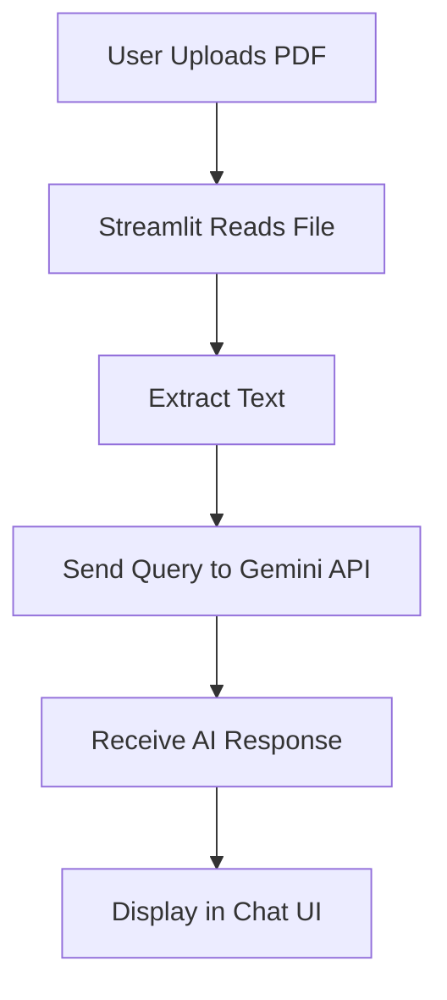

# 📄 PDF Chatbot with Gemini API

> Chat with your PDFs using Google's **Gemini AI** in a sleek **Streamlit** app.  
> Upload a PDF, ask questions in natural language, and get intelligent responses instantly.

---

## 🚀 Features

- **📚 PDF Upload** – Drag & drop PDF files into the app.
- **🤖 LLM Powered** – Uses **Google Gemini API** (Bard successor).
- **💬 Interactive Chat** – Ask questions, get context-aware answers.
- **🌐 Hugging Face Fallback** – Optional integration with Hugging Face models.
- **⚡ Streamlit UI** – Fast, minimal, browser-based interface.

---

## 📦 Installation

### 1️⃣ Clone the repository
```bash
git clone https://github.com/Aditya-hub2k03/pdf_chatbot.git
cd pdf_chatbot
```

### 2️⃣ Create & activate virtual environment
```bash
# Create
pip install virtualenv
virtualenv venv

# Activate
# Windows
venv\Scripts\activate
# Linux/Mac
source venv/bin/activate
```

### 3️⃣ Install dependencies
```bash
pip install -r requirements.txt
```

---

## 🔑 Environment Variables

Create a `.env` file in the root directory and add:

```env
GOOGLE_API_KEY=your_google_gemini_api_key
HUGGINGFACEHUB_API_TOKEN=your_hugging_face_token
```

---

## ▶️ Running the App

```bash
streamlit run app.py
```

Your browser will open at:  
```
http://localhost:8501
```

---

## 🧩 Project Structure

```
pdf_chatbot/
│
├── app.py               # Main Streamlit app
├── htmlTemplates.py     # HTML UI templates
├── requirements.txt     # Dependencies
├── .env.example         # Example environment variables
└── README.md            # Project documentation
```

---

## 🛠 How It Works



---

## 📜 Example Usage

```python
from app import process_pdf, query_gemini

text_data = process_pdf("document.pdf")
response = query_gemini("Summarize the document", text_data)

print(response)
```

---

## 🌐 Deployment

Deploy easily on:

- **Streamlit Cloud**
- **Hugging Face Spaces**
- **Heroku / Render**
- **Local Server**

---

## 🤝 Contributing

Contributions are welcome!

1. **Open an Issue**
2. **Submit a Pull Request**

---

